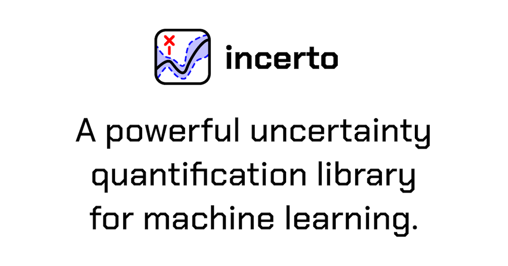
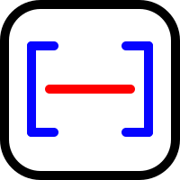
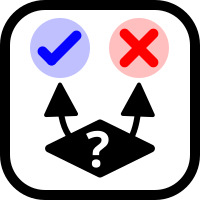
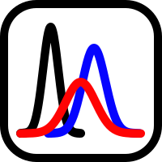
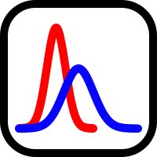
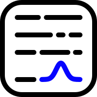
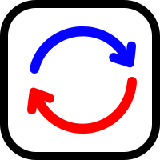
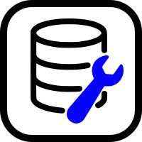

<div align="center">
  
</div>

<div align="center">

[](https://github.com/steverab/incerto/actions/workflows/tests.yml)
[](https://www.python.org/downloads/)
[](https://opensource.org/licenses/MIT)
[](https://codecov.io/gh/steverab/incerto)
[](https://github.com/psf/black)

</div>

**incerto** is a comprehensive Python library for **uncertainty quantification in machine learning**. It provides state-of-the-art methods for calibration, out-of-distribution detection, conformal prediction, selective prediction, and uncertainty estimation in deep learning and LLMs.

Latin *incerto* = "uncertain, doubtful, unsure".

> [!WARNING]
> This is a v0.1 alpha release. The API may change without notice before v1.0.
> Tested with PyTorch ≥ 2.0, NumPy ≥ 1.24, scikit-learn ≥ 1.3, scipy ≥ 1.11.
> Please report any issues on [GitHub](https://github.com/steverab/incerto/issues).

## 🎯 Key Features

**incerto** provides a unified interface for:

###  **Calibration**
- **Post-hoc calibration**: Temperature scaling, Platt scaling, isotonic regression, histogram binning
- **Training-time methods**: Label smoothing, focal loss, confidence penalty, evidential deep learning
- **Metrics**: ECE, MCE, Brier score, NLL, reliability diagrams

###  **Out-of-Distribution (OOD) Detection**
- **Score-based methods**: MSP, MaxLogit, Energy, ODIN
- **Distance-based methods**: Mahalanobis distance, KNN
- **Training methods**: Mixup, CutMix, Outlier Exposure, Energy regularization

###  **Conformal Prediction**
- **Classification**: Inductive CP, APS, RAPS, Mondrian CP
- **Regression**: Jackknife+, CV+
- Distribution-free uncertainty quantification with coverage guarantees

###  **Selective Prediction**
- Confidence thresholding (Softmax Threshold)
- Self-Adaptive Training (SAT)
- Deep Gambler, SelectiveNet
- Risk-coverage tradeoffs

###  **Bayesian Deep Learning**
- **MC Dropout**: Uncertainty via dropout at test time
- **Deep Ensembles**: Train multiple models for robust predictions
- **SWAG**: Stochastic Weight Averaging - Gaussian
- **Laplace Approximation**: Gaussian posterior around MAP estimate
- **Variational Inference**: Bayes by Backprop
- **Uncertainty decomposition**: Separate epistemic & aleatoric uncertainty

###  **Distribution Shift Detection**
- **Statistical tests**: MMD, Energy distance, Kolmogorov-Smirnov
- **Classifier-based**: Black-Box Shift Detection (BBSD)
- **Label shift**: Detect and correct label distribution changes
- **Importance weighting**: Covariate shift adaptation

###  **LLM Uncertainty**
- **Token-level**: Entropy, confidence, perplexity, surprisal
- **Sequence-level**: Sequence probability, average log-prob
- **Sampling-based**: Self-consistency, semantic entropy, predictive entropy
- **Generation methods**: Beam search uncertainty, nucleus sampling, contrastive decoding

###  **Active Learning**
- **Acquisition functions**: Entropy, BALD, margin, variance ratio
- **Query strategies**: Uncertainty sampling, diversity sampling, Core-Set, BADGE
- **Batch selection**: BatchBALD for efficient batch queries
- **Committee methods**: Query by Committee (QBC)

###  **Data & Utilities**
- Built-in datasets (MNIST, CIFAR-10/100, SVHN)
- OOD benchmark datasets
- Visualization utilities
- Common architectures (ConvNet, ResNet)

## 🚀 Installation

### From PyPI
```bash
pip install incerto
```

With optional extras:
```bash
pip install incerto[vision]   # + torchvision for vision datasets
pip install incerto[llm]      # + transformers, accelerate, sentence-transformers
pip install incerto[all]      # all optional dependencies
```

### From source
```bash
git clone https://github.com/steverab/incerto.git
cd incerto
pip install -e .
```

## 📖 Quick Start

### Calibration

```python
import torch
from torch.utils.data import DataLoader
from incerto.calibration import TemperatureScaling, ece_score

# Assume you have a trained model
model = ...  # Your trained classifier
model.eval()

# Collect validation predictions for calibration
val_logits, val_labels = [], []
with torch.no_grad():
    for x, y in val_loader:
        logits = model(x)
        val_logits.append(logits)
        val_labels.append(y)

val_logits = torch.cat(val_logits)
val_labels = torch.cat(val_labels)

# Fit temperature scaling on validation set
calibrator = TemperatureScaling()
calibrator.fit(val_logits, val_labels)
print(f"Learned temperature: {calibrator.temperature.item():.4f}")

# Apply calibration to test set
test_logits, test_labels = [], []
with torch.no_grad():
    for x, y in test_loader:
        logits = model(x)
        test_logits.append(logits)
        test_labels.append(y)

test_logits = torch.cat(test_logits)
test_labels = torch.cat(test_labels)

# Get calibrated logits
calibrated_logits = calibrator(test_logits)  # Applies temperature scaling

# Measure calibration improvement
ece_before = ece_score(test_logits, test_labels, n_bins=15)
ece_after = ece_score(calibrated_logits, test_labels, n_bins=15)
print(f"ECE before: {ece_before:.4f} | ECE after: {ece_after:.4f}")
```

### OOD Detection

```python
import torch
from torch.utils.data import DataLoader
from incerto.ood import Energy, auroc

# Load in-distribution and OOD datasets
id_loader = DataLoader(cifar10_test, batch_size=128)
ood_loader = DataLoader(svhn_test, batch_size=128)

# Create Energy-based OOD detector
detector = Energy(model, temperature=1.0)

# Compute scores (higher = more OOD)
id_scores = torch.cat([detector.score(x) for x, _ in id_loader])
ood_scores = torch.cat([detector.score(x) for x, _ in ood_loader])

# Evaluate detection performance — auroc takes the two score tensors directly
auc = auroc(id_scores, ood_scores)
print(f"OOD Detection AUROC: {auc:.4f}")

# Use detector with threshold
test_batch = next(iter(id_loader))[0]
predictions = detector.predict(test_batch, threshold=-10.0)
print(f"Detected {predictions.sum()} OOD samples")
```

### Conformal Prediction

```python
import torch
from torch.utils.data import DataLoader
from incerto.conformal import aps

# Calibrate conformal predictor (typically on held-out calibration set)
alpha = 0.1  # Miscoverage rate (1 - alpha = 90% coverage)
predictor = aps(model, calib_loader, alpha=alpha)

# Generate prediction sets on test data
prediction_sets = []
for x, y in test_loader:
    sets = predictor(x)  # List of sets, one per sample
    prediction_sets.extend(sets)

# Compute coverage and average set size
coverage = sum(y_true in pred_set
               for y_true, pred_set in zip(test_labels, prediction_sets))
coverage /= len(test_labels)

avg_size = sum(len(s) for s in prediction_sets) / len(prediction_sets)
print(f"Empirical coverage: {coverage:.3f} (target: {1-alpha:.3f})")
print(f"Average set size: {avg_size:.2f}")
```

### Selective Prediction

```python
import torch
from incerto.sp import SoftmaxThreshold

# Create selective predictor (wraps your trained model)
selector = SoftmaxThreshold(model)
selector.eval()

# Get logits and confidence scores for test data
all_logits, all_confidences = [], []
with torch.no_grad():
    for x, y in test_loader:
        logits, conf = selector(x, return_confidence=True)
        all_logits.append(logits)
        all_confidences.append(conf)

all_logits = torch.cat(all_logits)
all_confidences = torch.cat(all_confidences)
predictions = all_logits.argmax(dim=-1)

# Set confidence threshold (e.g., top 80% most confident)
threshold = all_confidences.quantile(0.2)  # Reject bottom 20%

# Evaluate selective accuracy
selected_mask = all_confidences >= threshold
selected_acc = (predictions[selected_mask] == test_labels[selected_mask]).float().mean()
coverage = selected_mask.float().mean()

print(f"Confidence threshold: {threshold:.4f}")
print(f"Coverage: {coverage:.2%}")
print(f"Selective accuracy: {selected_acc:.4f}")

# Reject high-uncertainty samples
rejected = selector.reject(all_confidences, threshold)
print(f"Rejected samples: {rejected.sum()}/{len(predictions)}")
```

### Bayesian Neural Networks

```python
import torch
from incerto.bayesian import VariationalBayesNN

# Create Variational Bayesian NN
# Specify architecture: input_dim, [hidden_sizes], output_dim
vbnn = VariationalBayesNN(
    in_features=784,
    hidden_sizes=[512, 256],
    out_features=10,
    prior_std=1.0
)

# Train with variational loss (likelihood + KL divergence)
optimizer = torch.optim.Adam(vbnn.parameters(), lr=0.001)

for epoch in range(10):
    vbnn.train()
    for batch_x, batch_y in train_loader:
        optimizer.zero_grad()
        # Variational loss with Monte Carlo sampling
        loss = vbnn.variational_loss(batch_x, batch_y, num_samples=10)
        loss.backward()
        optimizer.step()

# Get predictions with variance estimates
vbnn.eval()
with torch.no_grad():
    mean_pred, variance = vbnn.predict(test_x)

print(f"Average predictive variance: {variance.mean():.4f}")

# Identify high-uncertainty samples
high_unc_mask = variance > variance.quantile(0.9)
print(f"High uncertainty samples: {high_unc_mask.sum()}/{len(test_x)}")
```

### Distribution Shift Detection

```python
import torch
from torch.utils.data import DataLoader
from incerto.shift import MMDShiftDetector

# Load reference (training) data
reference_loader = DataLoader(train_dataset, batch_size=128)

# Load production data (potentially shifted)
production_loader = DataLoader(production_dataset, batch_size=128)

# Create MMD shift detector with Gaussian kernel
mmd_detector = MMDShiftDetector(sigma=1.0)

# Fit on reference distribution
mmd_detector.fit(reference_loader)

# Compute shift score on production data
shift_score = mmd_detector.score(production_loader)
baseline_score = mmd_detector.score(reference_loader)  # Self-test

# Calculate shift ratio
shift_ratio = shift_score / (baseline_score + 1e-10)
print(f"MMD shift score: {shift_score:.6f}")
print(f"Shift ratio: {shift_ratio:.2f}x")

# Alert based on shift magnitude
if shift_ratio > 2.0:
    print("⚠️  CRITICAL: Significant distribution shift detected!")
    print("   Recommendation: Retrain model immediately")
elif shift_ratio > 1.5:
    print("⚠️  WARNING: Moderate shift detected")
    print("   Recommendation: Monitor closely, consider retraining")
else:
    print("✓ No significant shift detected")
```

### LLM Uncertainty

```python
import torch
from transformers import AutoModelForCausalLM, AutoTokenizer
from sentence_transformers import SentenceTransformer
from incerto.llm import SemanticEntropy, TokenEntropy

# Load language model and embedding model
model = AutoModelForCausalLM.from_pretrained("gpt2")
tokenizer = AutoTokenizer.from_pretrained("gpt2")
embedding_model = SentenceTransformer('all-MiniLM-L6-v2')
model.eval()

# Example prompt
prompt = "The capital of France is"
inputs = tokenizer(prompt, return_tensors="pt")

# --- Token-level uncertainty ---
with torch.no_grad():
    outputs = model(**inputs, return_dict=True)
    logits = outputs.logits

token_entropy = TokenEntropy.compute(logits)
print(f"Average token entropy: {token_entropy.mean():.4f}")

# --- Semantic Entropy: cluster semantically equivalent responses ---
num_samples = 10
responses = []
for _ in range(num_samples):
    output_ids = model.generate(
        **inputs,
        max_length=50,
        do_sample=True,
        temperature=0.8,
        top_p=0.9,
        num_return_sequences=1
    )
    response = tokenizer.decode(output_ids[0], skip_special_tokens=True)
    responses.append(response)

# Compute semantic entropy with embedding model
semantic_unc = SemanticEntropy.compute(
    responses,
    similarity_threshold=0.85,
    embedding_model=embedding_model
)

print(f"Semantic entropy: {semantic_unc['semantic_entropy']:.4f}")
print(f"Number of semantic clusters: {semantic_unc['num_clusters']}")

# High semantic entropy indicates uncertainty
if semantic_unc['semantic_entropy'] > 1.5:
    print("⚠️  High uncertainty: Model gives diverse semantic answers")
else:
    print("✓ Low uncertainty: Responses are semantically consistent")
```

## 📚 Examples

The `examples/` directory contains Jupyter notebook tutorials covering all major features:

| Notebook | Description |
|----------|-------------|
| [01_calibration.ipynb](examples/01_calibration.ipynb) | Post-hoc and training-time calibration methods |
| [02_ood_detection.ipynb](examples/02_ood_detection.ipynb) | Out-of-distribution detection techniques |
| [03_selective_prediction.ipynb](examples/03_selective_prediction.ipynb) | Selective classification with reject option |
| [04_conformal_prediction.ipynb](examples/04_conformal_prediction.ipynb) | Distribution-free prediction sets |
| [05_bayesian_uncertainty.ipynb](examples/05_bayesian_uncertainty.ipynb) | Bayesian neural networks and uncertainty |
| [06_active_learning.ipynb](examples/06_active_learning.ipynb) | Query strategies and acquisition functions |
| [07_shift_detection.ipynb](examples/07_shift_detection.ipynb) | Distribution shift detection methods |
| [08_llm_uncertainty.ipynb](examples/08_llm_uncertainty.ipynb) | LLM uncertainty quantification |

## 🧪 Testing

**incerto** has comprehensive test coverage (**982 tests**, 100% passing):

```bash
# Run all tests
pytest

# Run specific module tests
pytest tests/test_calibration/
pytest tests/test_ood/
pytest tests/test_conformal/
pytest tests/test_shift/
pytest tests/test_bayesian/
pytest tests/test_active/

# Run with coverage
pytest --cov=incerto --cov-report=term-missing
```

## 📊 Supported Methods

<details>
<summary><b>Calibration Methods</b></summary>

**Post-hoc:**
- Temperature Scaling
- Vector Scaling
- Matrix Scaling
- Platt Scaling
- Isotonic Regression
- Histogram Binning
- Dirichlet Calibration
- Beta Calibration

**Training-time:**
- Label Smoothing
- Focal Loss
- Confidence Penalty
- Evidential Deep Learning
- Temperature-Aware Training

**Metrics:**
- Expected Calibration Error (ECE)
- Maximum Calibration Error (MCE)
- Classwise ECE
- Brier Score
- Negative Log-Likelihood (NLL)
</details>

<details>
<summary><b>OOD Detection Methods</b></summary>

**Score-based:**
- Maximum Softmax Probability (MSP)
- MaxLogit
- Energy Score
- ODIN

**Distance-based:**
- Mahalanobis Distance
- K-Nearest Neighbors (KNN)

**Training-time:**
- Mixup
- CutMix
- Outlier Exposure
- Energy Regularization
</details>

<details>
<summary><b>Conformal Prediction Methods</b></summary>

**Classification:**
- Inductive Conformal Prediction (ICP)
- Adaptive Prediction Sets (APS)
- Regularized APS (RAPS)
- Mondrian Conformal Prediction

**Regression:**
- Jackknife+
- CV+
- Conformalized Quantile Regression
</details>

<details>
<summary><b>LLM Uncertainty Methods</b></summary>

**Token-level:**
- Token Entropy
- Token Confidence
- Perplexity
- Surprisal Score
- Top-K Confidence

**Sequence-level:**
- Sequence Probability
- Average Log-Probability
- Sequence Entropy

**Sampling-based:**
- Self-Consistency
- Semantic Entropy
- Predictive Entropy
- Mutual Information

**Generation:**
- Beam Search Uncertainty
- Nucleus Sampling Uncertainty
- I Don't Know Detection
- Contrastive Decoding
</details>

<details>
<summary><b>Selective Prediction Methods</b></summary>

- Softmax Threshold (confidence thresholding)
- Deep Gambler
- SelectiveNet
- Self-Adaptive Training (SAT)
</details>

<details>
<summary><b>Bayesian Methods</b></summary>

- MC Dropout
- Deep Ensembles
- SWAG (Stochastic Weight Averaging - Gaussian)
- Laplace Approximation
- Variational Bayes (Bayes by Backprop)
</details>

<details>
<summary><b>Shift Detection Methods</b></summary>

**Statistical:**
- MMD (Maximum Mean Discrepancy)
- Energy Distance
- Kolmogorov-Smirnov Test

**Classifier-based:**
- Black-Box Shift Detection (BBSD)
- Label Shift Detection
- Importance Weighting
</details>

<details>
<summary><b>Active Learning Methods</b></summary>

**Acquisition Functions:**
- Entropy Sampling
- BALD (Bayesian Active Learning by Disagreement)
- Least Confidence
- Margin Sampling
- Variance Ratio
- Mean STD
- BatchBALD

**Query Strategies:**
- Uncertainty Sampling
- Diversity Sampling
- Core-Set Selection
- BADGE
- Query by Committee
</details>

## 🤝 Contributing

Contributions are welcome! Please see [CONTRIBUTING.md](CONTRIBUTING.md) for guidelines.

## 📄 License

This project is licensed under the MIT License - see the [LICENSE](LICENSE) file for details.

## 📖 Citation

If you use **incerto** in your research, please cite:

```bibtex
@software{incerto2025,
  author = {Rabanser, Stephan},
  title = {incerto: Uncertainty Quantification for Machine Learning},
  year = {2025},
  url = {https://github.com/steverab/incerto},
  version = {0.1.0}
}
```

## 🔗 Links

- **Documentation**: [incerto.dev/docs](https://incerto.dev/docs/)
- **Website**: [incerto.dev](https://incerto.dev)
- **Issues**: [GitHub Issues](https://github.com/steverab/incerto/issues)

---

**Status**: Active development | **Version**: 0.1.0 | **Python**: 3.10+
